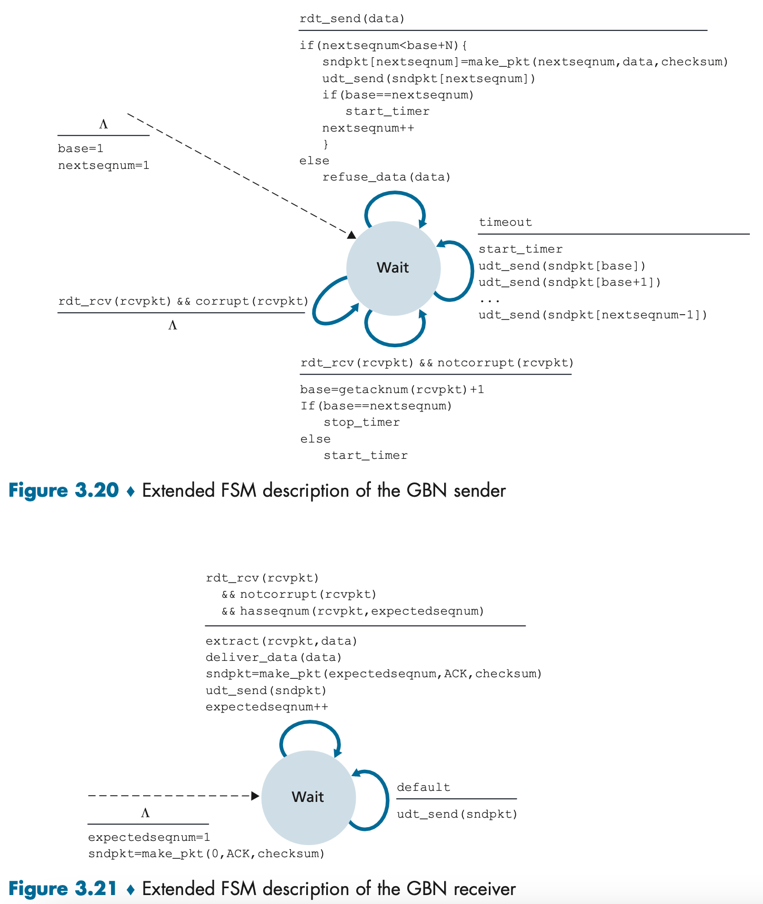

# GBN ARQ UDP Implementation in C

# Header

```c
typedef struct {
    uint8_t pack_type; // SYN=1, ACK=2, NAK=3, DATA=4, FIN=5
    uint16_t seq_num;
    uint16_t checksum;
    size_t data_len;
    char file_name[FILE_NAME_LEN];
    char data[BUF_SIZE];
} header;
```

1. `pack_type`
    - 패킷의 카테고리 (SYN, ACK, NAK 등)를 의미함. 현재 Sender와 Receiver의 상황에 적합한 `pack_type`이 아닌 예기치 않은 `pack_type` 을 수신할 경우에는 재수신 하거나 에러를 발생시키는 등 Send/Receive 단계에 해당하는 작업이 수행된다.
2. `seq_num`
    - Sender: 발신 시에는 `nextseqnum` 을 의미함. 파일을 발신하는 입장에서 현재 내가 보내는 패킷의 순서 번호를 의미함. 수신 시에는 Receiver로부터 올바른 수신 여부를 판단하는데 사용됨.
    - Receiver: 발신 시에 `expectedseqnum` 을 의미하며 예상하고 있는 seq_num 값을 Sender에게 전달함. 수신 시에는 Sender가 전송하는 패킷의 순서를 받아 순서에 맞게 수신이 되고 있는지 판단하는 데에 사용됨.
3. `checksum`
    - Sender → Receiver에게 전달하는 헤더가 도중에 내용이 손상되었거나 변경되었음을 감지하게 위해 계산된 값. Receiver는 체크섬을 받아 계산하여 Sender에게로부터 수신받은 체크섬과 일치하는지 여부를 확인함.
4. `data_len`
    - 파일 저장 `fwrite()` 시 `items` 파라미터에 필요한 데이터의 길이.
5. `file_name`
    - 파일명, 확장자를 Receiver에게 전달함.
6. `data`
    - 실제 파일의 데이터. `BUF_SIZE` 만큼 나누어 전송됨.

# Protocol



- Computer Networking A Top Down Approach 8th Edition 3.20 및 3.21 에 나와있는 FSM와 거의 동일한 방식으로 설계함

## Client (Sender)

1. 서버에게 파일을 보낼 것이라는 SYN 패킷을 전송한다. `seq_num = 0` 로 전송하며, 전송 예정인 파일명도 헤더에 포함하여 헤더를 전송한다.
2. 서버로부터 ACK 을 받게 되면 파일 전송을 시작한다. 에
    1. 설정된`BUF_SIZE` 만큼 파일을 `fread()` 으로 읽은 후 `nextseqnum` 과 함께 Window Size만큼 전송을 반복한다. 반복이 끝나면 타이머를 시작하여 서버로부터 답을 기다린다.
    2. 서버로부터 ACK 을 수신받아 서버에게 받은 seq_num + 1을 `base` 에 저장한다. 클라이언트가 마지막으로 보낸 패킷 seq_num까지 받게 되면 타이머를 중단하고 다시 2-a 과정을 반복한다.
    3. 발신이 모두 끝나게 되어 서버로부터 최종 seq_num까지 수신하게 되면

       `gbn_header->pack_type = FIN` 으로 설정하여 파일 전송이 완료되었음을 알린다.

    4. 서버로부터 FIN 에 대한 ACK을 수신하게 되면 프로그램을 종료한다.
    5. 전송 도중 서버로부터 수신한 seq_num의 순서가 맞지 않을 경우 `base = 1, nextseqnum = 1` 로 변경한뒤 2-a 로 돌아간다.
    6. Timeout 발생 시 마지막 `base` 값부터 다시 파일 전송을 재개한다.

## Server (Receiver)

1. 클라이언트로부터 SYN 패킷을 수신받게 되면 ACK 를 보내준다. 이때 수신한 파일명으로 파일을 생성하여 파일을 수신받을 준비를 한다. `FILE *fp = fopen(file_name, "wb")`
2. `expectedseqnum` 변수를 사용해 패킷(파일)이 순서대로 수신되고 있는지 확인하며 파일을 저장한다. 체크섬이 실제 수신한 데이터의 체크섬과 일치할 경우 header에 포함된 `data_len` 의 값을 통해 파일 쓰기를 진행하여 파일이 손상되는 일이 없도록 하여 파일 쓰기를 진행한다.
3. 만약 중복 패킷을 수신받게 되면 다시 받아야 하는 패킷의 `seq_num` 을 클라이언트에게 전송한다.
4. 클라이언트로부터 FIN 을 받게 되면 ACK을 발신한 뒤 `fclose(fp)`와 함께 파일 수신을 종료한다.

# Timer

1. `timer_t timerID` 글로벌 변수로 timerID를 선언한다.
2. Sender ←→ Receiver 간 파일전송 전 SYN, ACK이 완료되면 timer를 생성(시작X)한다.

    ```c
    void init_timer(timer_t *_timerID) {
        struct sigaction sa;
        struct sigevent te;
    
        sa.sa_flags = 0;
        sa.sa_sigaction = NULL;
        sa.sa_handler = timeout_handler;
        sigaction(SIGTYPE, &sa, NULL);
    
        // Set timer
        te.sigev_notify = SIGEV_SIGNAL;
        te.sigev_signo = SIGTYPE;
        te.sigev_value.sival_ptr = _timerID;
        timer_create(CLOCK_REALTIME, &te, _timerID);
    }
    ```

3. window slide가 될 때마다 타이머를 시작한다. `itimerspec` 구조체를 생성하여 타이머를 시작하거나, 올바른 송수신이 발생할 경우에는 `itimerspec` 구조체의 `tv_sec` 값을 0으로 설정하여 타이머를 중단한다.

    ```c
    void start_stop_timer(timer_t *_timerID, int value) {
        struct itimerspec its;
        its.it_value.tv_sec = value == 0 ? 0 : value;
        its.it_value.tv_nsec = 0;
        its.it_interval.tv_sec = 0;
        its.it_interval.tv_nsec = 0;
        timer_settime(*_timerID, 0, &its, NULL);
    }
    ```


# Results


